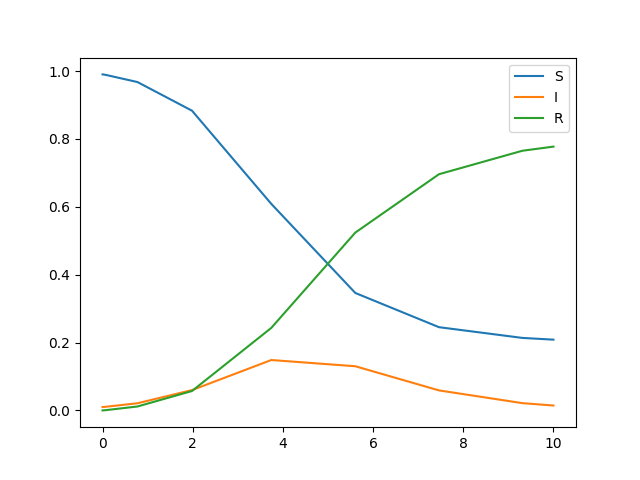

# petrinets

Python implementation of Petri nets.

## Usage

Define a Petri net as follows:

```python
# SIR model
net = PetriNet(
  species     = [0,1,2],
  transitions = [0,1],
  edges_in  = [(0,0), (1,0), (1,1)],
  edges_out = [(0,1), (0,1), (1,2)]
)
```

Compute the time derivative using mass action kinetics:

```python
time_dot(net, x=[1.0, 2.0, 3.0], rates=[1.0, 1.2])
```

Use ODE solvers such as scipy's solve_ivp:

```python
from scipy.integrate import solve_ivp

soln = solve_ivp(
  fun=lambda t, x: time_dot(net, x=x, rates=[2.0, 1.0]),
  t_span = [0.0, 10.0],
  y0 = [0.99, 0.01, 0.00],
)
```

Plot the solution with matplotlib:

```python
import matplotlib.pyplot as plt
for i in range(len(soln.y)):
  plt.plot(soln.t, soln.y[i], label=i)
plt.legend()
plt.show()
```


